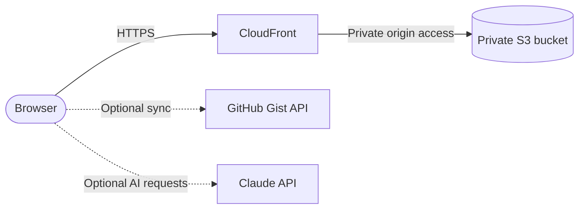

# JH TaskOps

A cloud engineering project built upon [JH Task Tracker](https://github.com/JessamyH/jh-task-tracker), exploring cloud infrastructure, DevOps automation and AI integration.

## Overview

JH TaskOps is a personal engineering project focused on evolving an existing productivity application through hands-on cloud and DevOps exploration.

This repository serves as a space for continuous learning, experimentation, and technical improvement.

## Live Demo

**[Open JH TaskOps](https://dc46h4g5wl78u.cloudfront.net)**

## Architecture

### Phase 1: AWS frontend deployment

The frontend is a single static page (`index.html`) stored in a private S3 bucket and served to users through CloudFront over HTTPS.

- **CloudFront** is the only public entry point and serves the app over HTTPS.
- **S3** is private and is not directly accessible; CloudFront reads from it as the origin.
- **Application data** stays in the browser's LocalStorage, with optional cloud sync through GitHub Gist.
- **AI features** call the Claude API directly from the browser.

**Definition of done:** JH TaskOps can be accessed through a CloudFront HTTPS URL, with the frontend stored in a private S3 bucket. Existing application functionality continues to work.

**Verified:**

- Application loads successfully through CloudFront over HTTPS
- S3 bucket remains private and is accessible through CloudFront
- LocalStorage persists application data correctly
- GitHub Gist sync continues to work
- Claude AI integration continues to work

## License

This project is licensed under the MIT License. See the [LICENSE](LICENSE) file for details.
